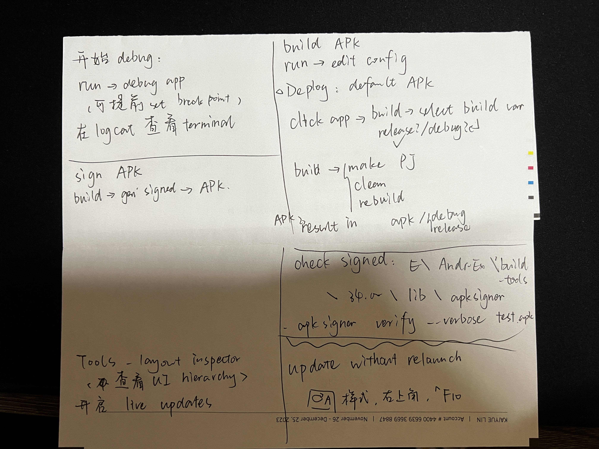

## How to configure Android Studio

Change __Gradle__: File -> PJ Structure -> Select by clicking the drop down menu of gradle

Access : View - Tool Windows - Device File Explorer

  在 data/data 下面可以找到 db 管理文件

## RecycleView of Links

1. Add a "Link Collector" button to the main activity that brings up a new activity when tapped.

2. New activity should have a list of links using a RecyclerView in a ConstraintLayout. 用 __card item__ 来实现

3. Tap a floating action button to start entering a new link, in which case the user enters a name and a URL for the link, which are added together to the list. Both the name and the URL should be displayed for each item in the list.

4. You design the best way to implement UI, but it must start with a floating action button click.
__弹窗增加新 unit__

5. When the user taps a URL in the list, launch the URL in a web browser (use an intent, not android:autolink). __Think about what the other actions should do.__

6. Implement the deletion of an item in the list and the editing of an item in the list (edit the name and URL).  What should this UI look like? __左滑 显示 delete 和 edit__

7. Link data must persist for a configuration change using a Bundle (display rotation - see Bundle and Parcel in course materials). __But if quitted or 上滑, dont need to persist__ Dont block rotation

8. __Submission__ Attach a text file containing a GitHub link and a signed APK attachment.

(9). Every item view

## Recycler View

### 1 Bundle and Parcel

When object A refers object B in memory, it can refer to B's memory address. If you store A, and take it out a moment later, B may disappear and causes A's error. __Bundle__'s solution: instead of cpoying B's reference, a bundle every time gets B's data, and returns it into the objetc when pasting. (Shallow and deep copy)

__Parcel__ is just a comtomized version of __Bundle__

### 2 Recycler View

If the content cannot be all together shown in one screen, the UI shows it in a 滚动幕

__-- Sample Code 研究__

__activity xml__

constrainLayout 下新增 recycler view 组件

__item_person xml__

RelativeLayout 下 两个 TextView ?怎么加入新的按钮?

__PersonViewHolder.java__

这个 java class 用来提供 item_person 到 adapter 的绑定

它的 constructor 需要一个输入参数- View 类型

__PersonAdapter.java__

这个类 作为 arrayList\<Person\> 到 PersonView 之间的桥梁（ View 包含 TextView RevyclerView之类的小原件）

constructor 两个入参： List\<Person\> 型 和 Context 型

onBindViewHolder 里

  assume 了 holder.name 是一部分

